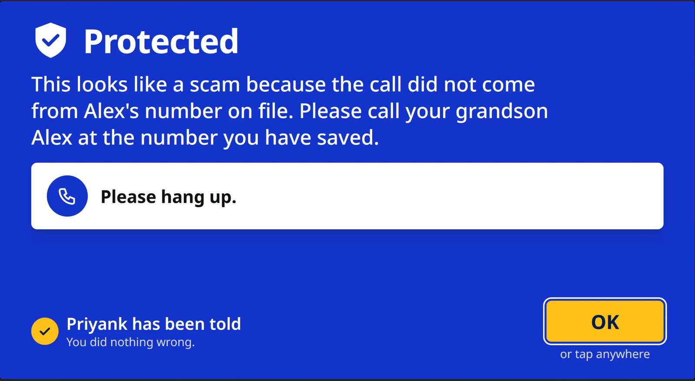
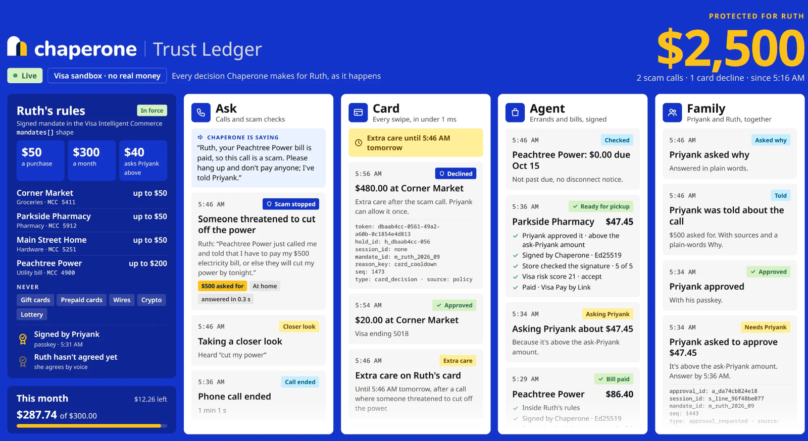
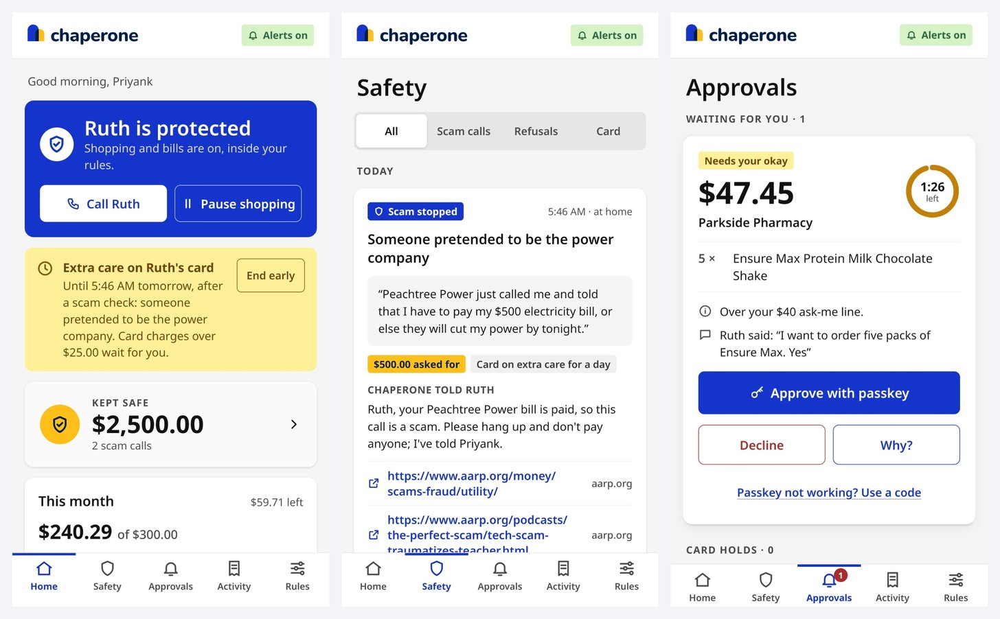
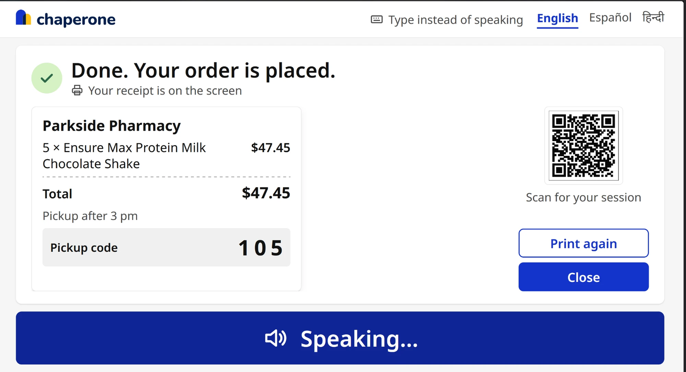
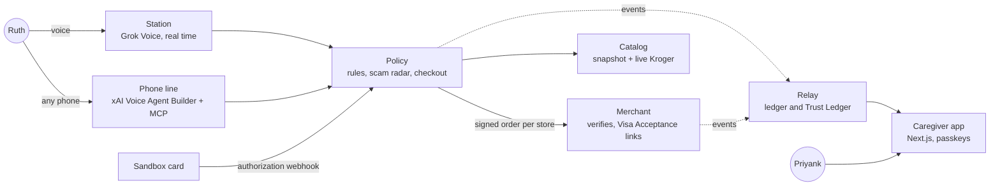

# Chaperone

**A voice-first AI shopping agent for older adults.** Ruth talks to a kiosk at home, or calls a phone number from any phone, in English, Spanish or Hindi. Chaperone shops, pays her bills and handles returns, but it can only spend inside rules her son Priyank signed with a passkey, and it says no to the scam out loud.



## Why

Americans over 60 reported **$7.7 billion** lost to fraud in 2025 ([FBI IC3](https://www.housingwire.com/articles/fbi-seniors-cybercrime-2025/)). A lot of it starts with a phone call: a "grandson" in jail, a "lawyer" who needs the bail within the hour, a "power company" about to cut the lights, and a trip to the gift-card rack or a Bitcoin machine. The same people are often the ones shopping apps leave behind: older adults, people who don't read English comfortably, people without a smartphone.

Chaperone lets them shop just by talking, while their family sets the rules and sees every decision.

## What it does

It covers the whole journey, from finding a product to after the purchase:

- **Discover.** "My blood pressure medicine and pay my power bill." Chaperone finds her usual items first, and anything else live from Kroger at a real store's prices.
- **Decide.** Choices stay inside her approved stores, her preferences and what's left of her monthly budget. The cart is read back store by store, and nothing happens without a clear "yes".
- **Pay.** One signed order per store, which each store verifies before accepting. Anything above the "ask me" amount waits for Priyank's passkey. The AI never sees a card number.
- **After.** Pickup codes and order status by voice, cancellations before payment, returns and refunds only to the card that paid, and a receipt with a QR code to a public record of the session.

Four guards keep it safe:

| Guard | What it does |
|---|---|
| **Ask** | Ruth describes a call. Chaperone recognizes the scam in her language, checks it against her own accounts ("your Peachtree Power bill is paid, so this call is a scam") and recent scam reports, tells her the one thing to do next, and alerts Priyank with sources and a plain-English "Why?". |
| **Card** | Every swipe of her card is decided in real time against her rules. Gift cards and crypto machines never work. After a scam call, her card takes extra care for 24 hours, and Priyank can **Allow once** or **Keep blocked**. |
| **Agent** | Errands and bills happen only inside the signed rules: stores, categories, limits and approvals. |
| **Family** | Priyank signs the rules with a passkey, and Ruth hears them in her language and agrees by voice. |

**Trust you can see.** The Trust Ledger shows every decision live, with a "dollars protected" counter:



Priyank's app shows the same decisions on his phone: home, safety alerts and approvals.





## How it works



Design choices that matter:

- **The model never decides a payment.** Policy re-prices every cart from the catalog and applies the signed rules deterministically. The voice model can only ask; a read-back and a fresh "yes" gate every checkout.
- **Signed intent.** The caregiver's passkey (WebAuthn) signs a canonical (JCS) hash of the rules. Every order is signed with RFC 9421 HTTP Message Signatures in the Trusted Agent Protocol header format, and each store verifies it against the agent's JWKS before taking the order.
- **Scams are checked in two layers.** A rule lexicon in English, Spanish, Hindi and Hinglish answers known scams in under a second. For anything new, Grok's Responses API with X search and web search checks recent reports and returns citations.
- **Real-time card rules.** The card's authorization webhook asks policy about every swipe, and policy answers in under a millisecond.
- **Nothing sensitive leaks.** The phone PIN never reaches the ledger, the card number is never printed, and every event is validated against a JSON Schema contract.

## What's real and what's sandbox

Everything runs in sandboxes with test cards; no real money moves.

| Piece | Real | Not |
|---|---|---|
| **Visa Acceptance Pay by Link** (Cybersource sandbox, via the Acceptance Agent Toolkit) | A real sandbox payment link per order, on four separate sandbox merchant accounts. Cancelling deactivates it. | Our sandbox account can't authorize test cards (reason 150, [details](docs/visa-sandbox-auth-error.md)), so the demo confirms payment with a signed payment notice. |
| **Visa Decision Manager** | A real sandbox risk score for every order, on that store's account. | It scores Visa's sandbox test card, since the order has no card yet. |
| **Visa Transaction Controls** | Real sandbox calls: the card rules are mirrored to a test card, and VTC's answer is shown beside each swipe. | It runs in parallel and doesn't decide the swipe. |
| **Card swipes** (Lithic sandbox) | A real-time authorization webhook, answered by our rules. | Simulated sandbox swipes; nothing reaches a card network. |
| **Visa Intelligent Commerce** | The signed rules are expressed in its `mandates[]` shape. | The instruction API needs pilot access, so it isn't called ([probes](docs/visa-probes.md)). |
| **Kroger Products API** | Live search with real prices and stock at an Atlanta store. | The stores in the demo are fictional merchants. |

## Tech stack

- **Voice and AI:** Grok Voice (real time), xAI Voice Agent Builder, Model Context Protocol, Grok Responses API with X and web search.
- **Backend:** Python, FastAPI, httpx, JSON Schema; RFC 9421 signatures and Ed25519 keys; WebAuthn passkeys.
- **Frontend:** TypeScript and Vite (station), Next.js and React (caregiver app).
- **Payments and data:** Visa Acceptance (Cybersource) Pay by Link, Decision Manager, Visa Transaction Controls, Lithic, Kroger Products API, openFDA.

## Run it locally

Copy `.env.example` to `.env` and fill in the keys you have. Without them, the mocks run: `MOCK_VISA=1`, `JUDGE_FAKE=1`, `RADAR_FAKE=1`, `EXPLAIN_FAKE=1`. Never commit `.env`, `keys/` or `sessions/*.json`.

```bash
python3 -m venv .venv
.venv/bin/pip install -r requirements.txt
cp .env.example .env
```

The agent signing key is `keys/agent_ed25519.pem`, and its public key is `relay/jwks.json`. `POLICY_CODE_KEY` must be set, or policy won't start (`POLICY_DEV_KEY_OK=1` allows the public default, for tests only). `MANDATE_UNSIGNED_OK=1` lets checkout run before a passkey mandate is stored.

Run each service in its own terminal, from the repo root unless noted. Ports are listed in `contracts/ports.md`.

```bash
# catalog :8003
.venv/bin/python -m catalog.seed_openfda    # optional, no key
.venv/bin/python -m catalog.seed_kroger     # optional, needs KROGER_*
.venv/bin/python -m catalog.build_catalog
.venv/bin/python -m uvicorn catalog.search:app --host 0.0.0.0 --port 8003

# policy :8001  (checkout, screen, judge, scam check, card, mandate)
.venv/bin/python -m uvicorn policy.main:app --host 0.0.0.0 --port 8001

# merchant :8002  (one service, every store in contracts/merchants.json)
.venv/bin/python -m uvicorn merchant.orders:app --host 0.0.0.0 --port 8002

# relay :8000  (voice tokens, ledger, Trust Ledger, card terminal, JWKS, audio)
.venv/bin/python -m uvicorn relay.main:app --host 0.0.0.0 --port 8000

# phone line :8005  (see line/README.md)
.venv/bin/python -m uvicorn line.server:app --host 127.0.0.1 --port 8005

# station :5173
cd station/kiosk && npm install && npm run dev

# printer helper :8004  (optional; saves a PDF when no printer is attached)
.venv/bin/python -m uvicorn station.printer:app --host 127.0.0.1 --port 8004

# caregiver app :5175  (passkeys need a fixed HTTPS host, e.g. an ngrok domain)
cd caregiver && npm install && npm run dev
ngrok http 5175 --url https://<tunnel-host>
```

Set `TUNNEL_HOST` in `.env` to that hostname, with no scheme, and don't change it after the passkey is registered. The caregiver app forwards `/card/asa` to policy and `/line/*` to the phone line, so the card webhook and the phone agent share the tunnel.

Then open:
- the station at http://localhost:5173 (the microphone requires localhost);
- the Trust Ledger at http://localhost:8000/wall;
- the card terminal at http://localhost:8000/terminal;
- the caregiver app on a phone at `https://<tunnel-host>`.

To give Ruth a card, `python -m policy.card_setup` creates a Lithic sandbox card and enrolls `https://$TUNNEL_HOST/card/asa` as its authorization webhook. The phone line's setup, including the PIN, is in `line/README.md`.

## Tests and evaluation

```bash
.venv/bin/pytest -q
cd station/kiosk && npm test
cd caregiver && node --test lib/*.test.js
```

The scam evaluation covers 102 scripts (50 scams, 52 honest requests) in English, Spanish, Hindi and Hinglish. On the held-out half, rules plus Grok caught 25 of 25 scams and wrongly refused 1 of 24 honest requests. The scripts were written alongside the rules, so these numbers are in-sample; see `ai/eval/RESULTS.md`.

`docs/security-evidence.md` records the static scan and the controls the tests cover. It is not a PCI, ISO, NIST or SOC 2 certification.

## Repository layout

| Path | What it is |
|---|---|
| `policy/` | Rules engine, checkout, scam radar, card authorization, caregiver approvals |
| `merchant/` | The four demo stores: signature verification, Visa Acceptance links, risk scores, refunds |
| `relay/` | Event ledger, Trust Ledger wall, card terminal, session pages |
| `catalog/` | Product search over the snapshot, with live Kroger search |
| `line/` | The phone agent's MCP server |
| `station/` | The station: Ruth's voice kiosk (`station/kiosk/`), its voice persona and the receipt printer helper |
| `prototypes/screen/` | The first prototype of the scam rules, the judge and the refusal audio |
| `caregiver/` | Priyank's app |
| `ai/` | Rule lexicon, spoken lines in three languages, prompts, evaluation |
| `signer/`, `contracts/` | Signing keys, event schema, store registry |

## Team

Built by [Varun Bhandari](https://github.com/varunbhandarii), [Rohan Shah](https://github.com/rohan879), [Vraj Patel](https://github.com/goffycoder) and [Dhruv Patel](https://github.com/dhruv-1100).
